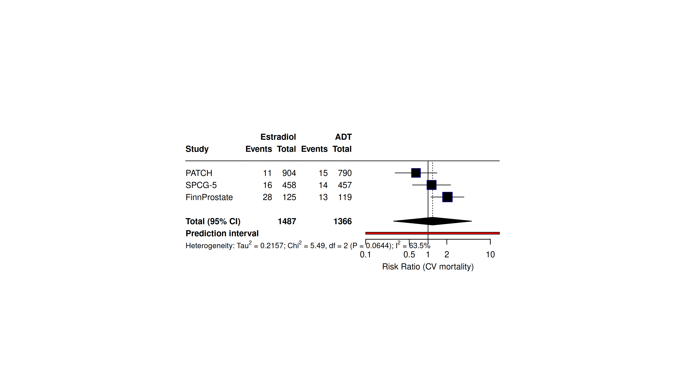
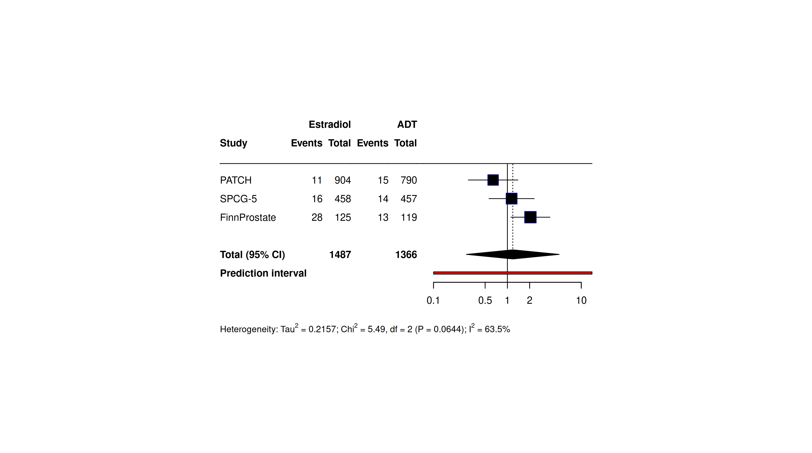
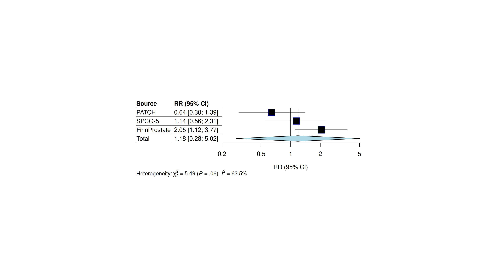
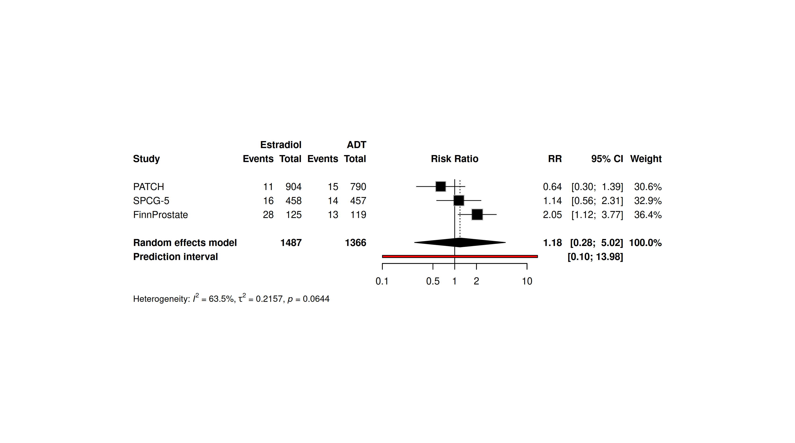

# forest-plot-styles

Material de estudo: o **mesmo** dado de meta-análise renderizado em vários estilos de *forest plot* (RevMan5, JAMA, meta clássico) com o pacote [`meta`](https://cran.r-project.org/package=meta) do R — e a correção de um problema comum de **espaçamento**, em que as estatísticas de heterogeneidade (I², τ², p) ficam **coladas / sobrepostas ao eixo X**.

Dado de exemplo: mortalidade cardiovascular de 3 ensaios (estradiol não-oral vs ADT padrão em câncer de próstata) — contagens públicas (PATCH, SPCG-5, FinnProstate). Pool: RR 1,18 (0,28–5,02), I² = 63,5%.

---

## 1. O problema de espaçamento (layout RevMan5)

No layout `RevMan5`, a linha de heterogeneidade é impressa logo abaixo do gráfico, **na mesma faixa vertical dos números do eixo X** — e, sendo uma linha larga, invade a região do eixo. Resultado: `(P = 0.0644); I² = 63.5%` fica em cima de `0.1 ... 1`.

**Antes (problema):**



### A correção

Dois parâmetros resolvem:

| Parâmetro | O que faz |
|---|---|
| `addrows.below.overall = 2` | Insere 2 linhas em branco abaixo do resultado combinado → empurra o **eixo X** pra baixo, dando linha própria aos números. |
| `xlab = ""` | Remove o **título do eixo** ("Risk Ratio …"), que disputava a mesma linha da estatística de heterogeneidade. O desfecho já vai na legenda da figura. |

(opcional: `spacing = 1.3` afrouxa as linhas em geral.)

**Depois (corrigido):**



Agora I², τ² e p ficam numa linha só, **abaixo** dos números do eixo, sem encostar.

> ⚠️ Pegadinhas que **não** funcionam: `addrow.below.overall` (sem o "s") e `xlab.pos` são ignorados silenciosamente nesse contexto. `print.Q = FALSE` também é ignorado no layout RevMan5 (o pacote força a estatística Q e emite um *warning*).

---

## 2. Galeria de estilos (mesmo dado)

### RevMan5 (Cochrane / RevMan)
Colunas Eventos/Total por braço, diamante do pool, *prediction interval*, heterogeneidade por extenso. É o padrão de revisões Cochrane. → figura `01_revman5_CORRIGIDO.png` acima.

### JAMA
Mais enxuto: coluna `Source` + `RR (95% CI)`, notação χ² com subscrito, sem *prediction interval* por convenção. Bom para periódicos do grupo JAMA.



### meta clássico (default do pacote)
Layout `meta` padrão — equilíbrio entre informação e limpeza, com pesos por estudo.



---

## 3. Referência rápida de parâmetros (`meta::forest`)

| Parâmetro | Efeito |
|---|---|
| `layout` | `"RevMan5"`, `"JAMA"`, `"meta"`, `"subgroup"` |
| `print.I2`, `print.tau2`, `print.pval.Q` | Liga/desliga I², τ² e o p do teste Q |
| `addrows.below.overall = n` | Linhas em branco abaixo do pool (afasta eixo/rodapé) |
| `xlab`, `smlab` | Título do eixo X / rótulo acima da coluna de efeito |
| `spacing` | Espaçamento vertical entre linhas |
| `label.e`, `label.c` | Nomes dos braços (cabeçalho) |
| `leftcols`, `rightcols` | Quais colunas mostrar à esquerda/direita |
| `col.square`, `col.diamond`, `col.study` | Cores |

---

## 4. Como rodar

```bash
# requisito: R + pacote meta
R -e 'install.packages("meta", repos="https://cloud.r-project.org")'

Rscript R/render_styles.R   # gera tudo em figures/
```

Se o `install.packages` falhar tentando **compilar do código-fonte** (erros em `lme4`, `tzdb`, `isoband`…), use **binários pré-compilados** do Posit P3M (Ubuntu — troque `noble` pelo seu codinome):

```r
options(HTTPUserAgent = sprintf("R/%s R (%s)", getRversion(),
        paste(getRversion(), R.version$platform, R.version$arch, R.version$os)))
install.packages("meta", repos = "https://packagemanager.posit.co/cran/__linux__/noble/latest")
```

---

## Estrutura

```
forest-plot-styles/
├── R/render_styles.R              # renderiza todos os estilos + o fix
├── data/cv_mortality_example.csv  # dado de exemplo (3 ensaios)
├── figures/                       # PNGs gerados
└── README.md
```

*Contexto: derivado do pipeline de meta-análise tE2-vs-ADT. Dados de desfecho são contagens já publicadas nos ensaios originais.*
